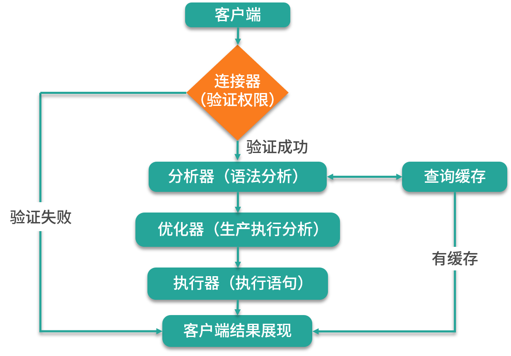

# 开篇

## 原理运行




## 常用引擎

```sql
# 查询语句
SHOW ENGINES;
```

引擎有很多种，MySQL 5.7默认使用InnoDB，其他较常见的引擎还有MyISAM和MEMORY。

其中 InnoDB 支持事务功能，而 MyISAM 不支持事务，但 MyISAM 拥有较高的插入和查询的速度。而 MEMORY 是内存型的数据库引擎，它会将表中的数据存储到内存中，因为它是内存级的数据引擎，因此具备最快速的查询效率，但它的缺点是，重启数据库之后，所有数据都会丢失，因为这些数据是存放在内存中的。


## 缓存

```sql
# 查询缓存是否开启
SHOW GLOBAL VARIABLES LIKE 'query_cache_type';
```

* OFF，关闭；
* ON，开启；
* DEMAND，按需缓存，即需要在sql语句中指定，如：`select sql_cache * from table_name where id` 


如果开启了缓存（在my.conf中配置，需要重启），任何一条对该表的更新操作都会将查询缓存清空。



在MySQL 8.0中，已经将缓存功能删除。


